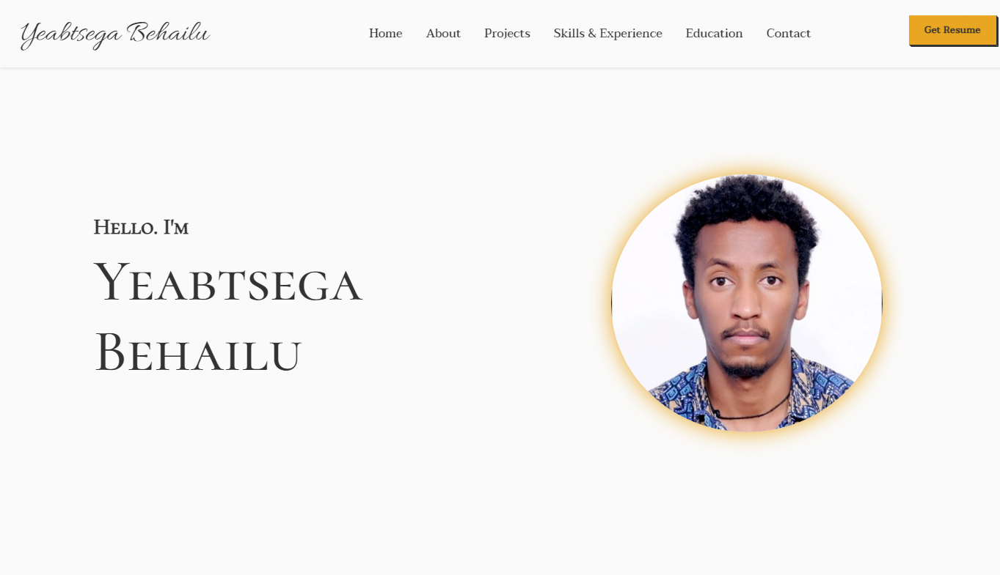

<p align="center">
  <a href="https://Yeabtsega1.github.io/">
    <h2 align="center">Sahib Singh</h2>
  </a>
</p> 
<p align="center">Full Stack Web Developer</p>




## :rocket: Quick start

**Run the site locally**

### Step 1: Clone The Repo

Fork the repository. then clone the repo locally by doing -

```bash
git clone https://github.com/Yeabtsega1/Yeabtsega1.github.io.git
```

### Step 2: Install Dependencies

cd into the directory

```bash
cd Yeabtsega1.github.io
```

install all the dependencies
```bash
npm install
```

### Step 3: Start Development Server

Then start the development Server
```
npm run dev
```
After running the development server the site should be running on https://localhost:3000


## :open_file_folder: What's inside?

A quick look at the folder structure of this project.

```
Portfolio
├─ .eslintrc.json
├─ .git
│  ├─ config
│  ├─ description
│  ├─ HEAD
│  ├─ hooks
│  │  ├─ applypatch-msg.sample
│  │  ├─ commit-msg.sample
│  │  ├─ fsmonitor-watchman.sample
│  │  ├─ post-update.sample
│  │  ├─ pre-applypatch.sample
│  │  ├─ pre-commit.sample
│  │  ├─ pre-merge-commit.sample
│  │  ├─ pre-push.sample
│  │  ├─ pre-rebase.sample
│  │  ├─ pre-receive.sample
│  │  ├─ prepare-commit-msg.sample
│  │  ├─ push-to-checkout.sample
│  │  └─ update.sample
│  ├─ index
│  ├─ info
│  │  └─ exclude
│  ├─ logs
│  │  ├─ HEAD
│  │  └─ refs
│  │     ├─ heads
│  │     │  └─ main
│  │     └─ remotes
│  │        └─ origin
│  │           └─ HEAD
│  ├─ objects
│  │  ├─ info
│  │  └─ pack
│  │     ├─ pack-013db03f282dc13104ce9eee3e00789c0da72df4.idx
│  │     └─ pack-013db03f282dc13104ce9eee3e00789c0da72df4.pack
│  ├─ packed-refs
│  └─ refs
│     ├─ heads
│     │  └─ main
│     ├─ remotes
│     │  └─ origin
│     │     └─ HEAD
│     └─ tags
├─ .github
│  └─ workflows
│     └─ nextjs.yml
├─ .gitignore
├─ components
│  ├─ About.js
│  ├─ Contact.js
│  ├─ Education.js
│  ├─ Footer.js
│  ├─ Header.js
│  ├─ index.js
│  ├─ Navbar.js
│  ├─ Project.js
│  └─ Skills.js
├─ data
│  ├─ about.js
│  ├─ education.js
│  ├─ project.js
│  └─ skillsExperience.js
├─ next.config.js
├─ package-lock.json
├─ package.json
├─ pages
│  ├─ 404.js
│  ├─ api
│  │  └─ hello.js
│  ├─ index.js
│  ├─ resume.js
│  ├─ _app.js
│  └─ _document.js
├─ public
│  ├─ 404.webp
│  ├─ favicon.ico
│  ├─ gaminggeeks-logo.webp
│  ├─ images
│  │  ├─ about
│  │  │  ├─ backend.webp
│  │  │  ├─ frontend.webp
│  │  │  └─ jain-svg.webp
│  │  ├─ backend.png
│  │  ├─ education
│  │  │  ├─ Atlas.jpeg
│  │  │  ├─ Beteseb.jpeg
│  │  │  └─ jain.png
│  │  ├─ favicon.ico
│  │  ├─ frontend.png
│  │  ├─ illustrations
│  │  │  └─ skill.png
│  │  ├─ nitj.png
│  │  ├─ projects
│  │  │  ├─ google-forms.webp
│  │  │  ├─ portfolio.webp
│  │  │  ├─ proofit.webp
│  │  │  ├─ quizbox.webp
│  │  │  ├─ react-ecommerce.webp
│  │  │  ├─ social-media.webp
│  │  │  ├─ TradeIT-logo.png
│  │  │  ├─ url-shortner.webp
│  │  │  ├─ wasteai.webp
│  │  │  ├─ YB.jpeg
│  │  │  └─ youtube.webp
│  │  └─ resume
│  │     └─ Resume - Sahib Singh.pdf
│  ├─ profile.jpg
│  ├─ resume.pdf
│  ├─ resume2.pdf
│  ├─ resume3.pdf
│  ├─ sitemap.xml
│  ├─ soorme.webp
│  └─ website.png
├─ README.md
└─ styles
   └─ globals.css

```
## :innocent: Feedback

If you have any feedback, please reach out to me [here](https://Yeabtsega1.github.io/#contact)
